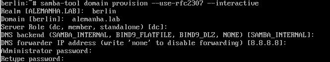
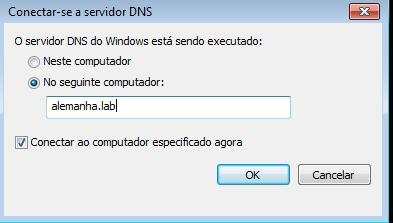
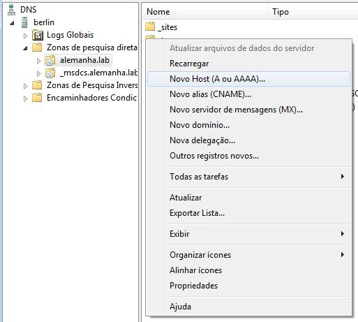
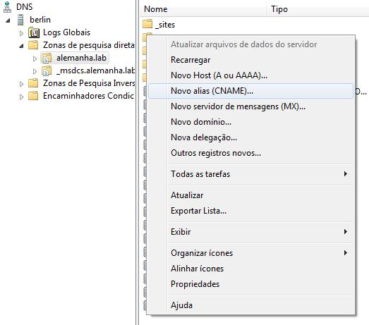
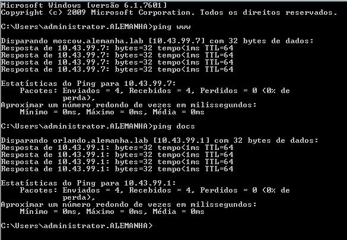

# DNS

## Instalação

-   samba-dc
-   krb5
-   smbclient

## Configuração
    
1º - Vamos configurar o nome de nossa máquina com o nome de nosso dominio em: (/etc/hostname)

    EX: berlin.alemanha.lab

2º - Agora configura a linha do local host em: (/etc/hosts)

    EX: berlin.alemanha.lab

2.1º - Faça um backup do arquivo smb.conf que está em: (/etc/samba/smb.conf)

2.2º - Desative o samba antes de iniciar o passo (3)

* Alpine (rc-service samba stop)
* Baseados no debian (systemctl stop samba)

3º - Após isso vamos configura nosso domínio usando:

-   samba-tool domain provision --use-rfc2307 --interactive

4º Essa são as etapas da configuração **(O que está entre [ ] e o padrão só da ENTER)**

4.1 Despois de configura vamo ativar o samba

* Alpine (rc-service samba start)
* Baseados no debian (systemctl start samba)

5º Após a configuração vamos para o windows **(Ambas as máquinas devem está na mesma rede)**

5.1º Vai abrir essa tela, digite o domínio criado

5.2º Quando entra, vai ficar assim:

6º Para criar um host A é assim: Clique com o direito na tela -> Novo Host (A ou AAAA)

6.1º Insira um nome e o ip de redirecionamento

6.2º Criando um cname

6.3º Atribuindo um cname: Informe um nome e clique em proucurar, encontre o A criado

7º Arquivo final 

## Teste

