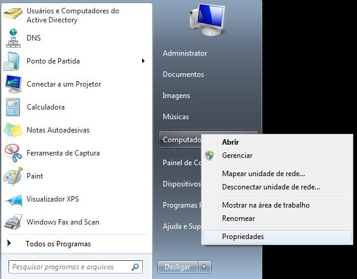

# LDAP

## Instalação

- Samba-ad
- Krb5

## Configuração

1º - Vamos configurar o nome de nossa máquina com o nome de nosso dominio em: (/etc/hostname)

    EX: berlin.alemanha.lab

2º - Agora configura a linha do local host em: (/etc/hosts)

    EX: berlin.alemanha.lab

2.1 - Faça um backup do arquivo smb.conf que está em: (/etc/samba/smb.conf)

3º - Após isso vamos configura nosso domínio usando:

-   samba-tool domain provision --use-rfc2307 --interactive

4º - Despois de criar seu dominio vamos configurar o aquivo smb.conf que está em: (/etc/samba)

5º - Agora vamos nos conctar ao domínio que criamos pelo windows vá em:

Clique em **Alterar configurações**

Depois em alterar, aparecerá uma tela menor, nela coloque o nome do computador e o domíno como está na imagem

6º - Para criar os usuários e grupos, estando na maquina windows pesquise sobre active directory e abra

6.1º - A criação e assim: Novo -> Usuário

Insira as credenciais dele.

senha..

7º - Após criar usuário, vamo criar as OU

 
 

8º Como podemos ver que foi criados duas OUS (vendedores e rh)

8.1 Essa imagens mostram cada grupo e usuário em suas OUS

 

Incluir o(s) nome(s) e o conteúdo do(s) arquivo(s) de configuração.

- Criar duas OU: `vendedores` e `rh`;
- Mover o grupo `sobrenome1` e seus membros para a OU `vendedores`;
- Mover os grupo `sobrenome2` e seus membros para a OU `rh`.

## Teste

 
 
