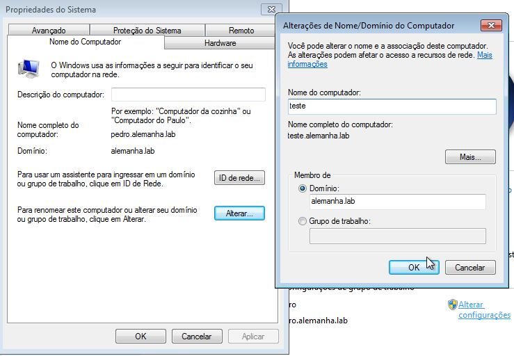
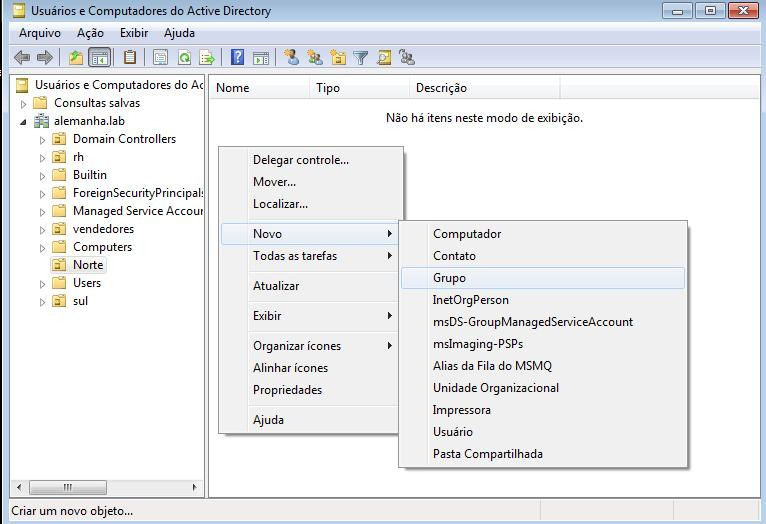

# SMB

## Instalação

-   samba-ad
-   krb5-config

## Configuração

1º - Vamos configurar o nome de nossa máquina com o nome de nosso dominio em: (/etc/hostname)

    berlin.alemanha.lab

2º - Agora configura a linha do local host em: (/etc/hosts)

    berlin.alemanha.lab

2.1 - Faça um backup do arquivo smb.conf que está em: (/etc/samba/smb.conf)

3º - Após isso vamos configura nosso domínio usando:

-   samba-tool domain provision --use-rfc2307 --interactive

4º - Despois de criar seu dominio vamos configurar o aquivo smb.conf que está em: (/etc/samba)

Nesse imagem mostra a configuração do compartilhamento de pasta com o windows, foram criadas duas pastas [Carvalho] e [sales]

5º - Agora vamos nos conctar ao domínio que criamos pelo windows vá em:

Clique em **Alterar configurações**

Depois em alterar, aparecerá uma tela menor, nela coloque o nome do computador e o domíno como está na imagem

6º - Para criar os usuários e grupos, estando na maquina windows pesquise sobre active directory e abra

6.1º - A criação e assim: Novo -> Usuário

Insira as credenciais dele.

senha..

6.2 - Criação de grupos: Novo -> Grupos

Insira o nome do grupo -> ok

8º - Nessa imagem e possívei ver os grupos criados e seu usuários

8.1 - Para adicionar usuário no grupo é assim: Seleciona o grupo -> vai na aba de mebros -> adicionar 

9º - Nessa etapa vemos que cada pessoa está em seu respectivo grupo

  [Alt text](index.md)

## Teste

